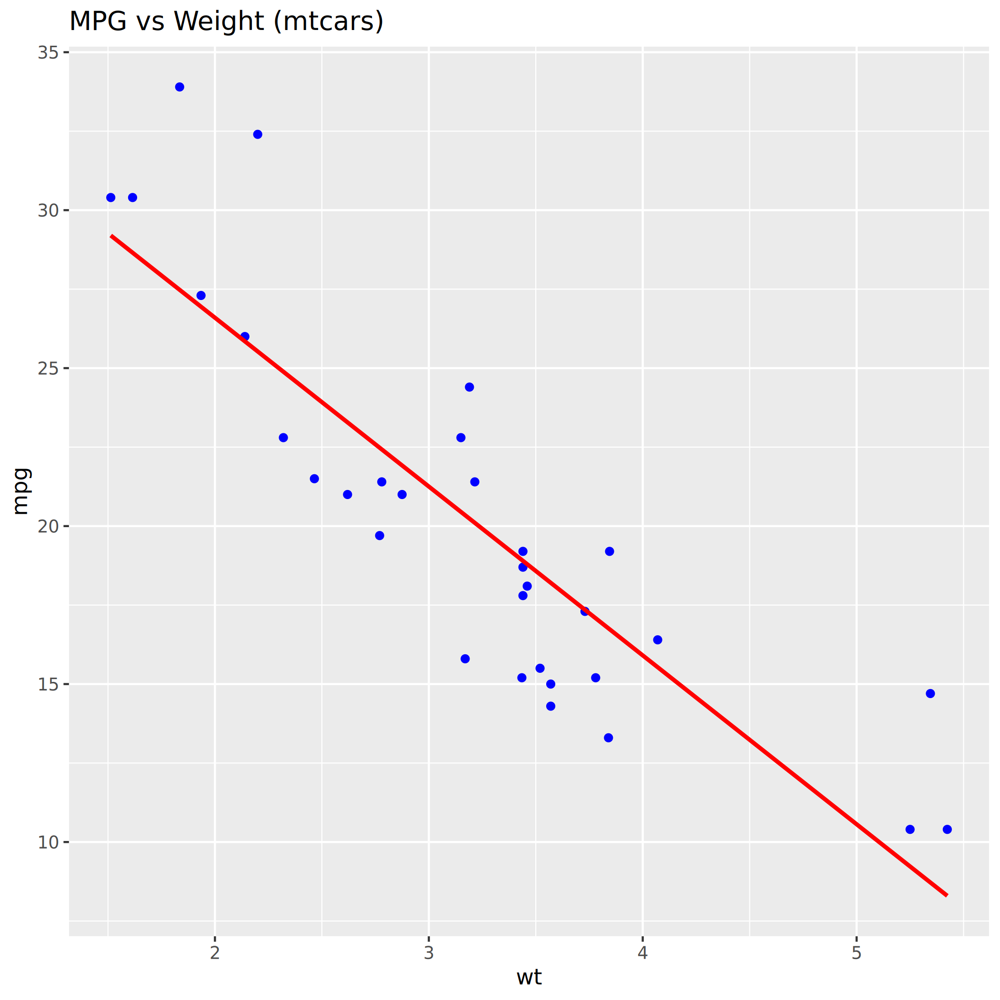
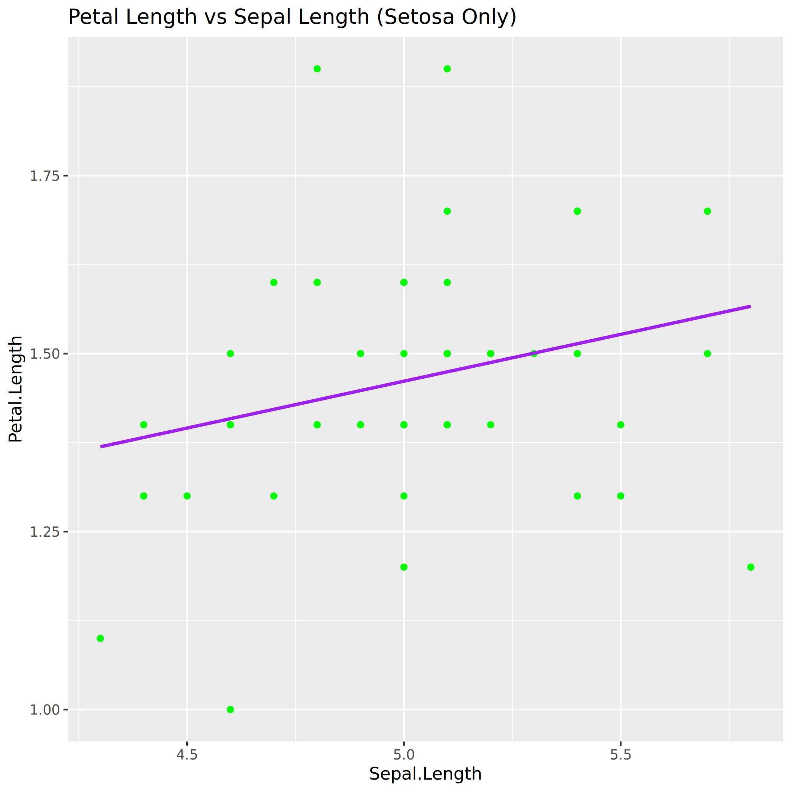

# 📊 R You Ready for Regression?

A beginner-friendly project using **R** to explore linear regression on built-in datasets: `mtcars` and `iris`.

## 📁 Files
- `regression_analysis.R` – R code to perform and visualize linear regression
- `mtcars_plot.png` – Regression plot: MPG vs Weight
- `iris_plot.png` – Regression plot: Petal Length vs Sepal Length (Setosa)
- `README.md` – Project overview

## 📦 Datasets Used
- `mtcars`: Predicts **miles per gallon (mpg)** using **car weight (wt)**
- `iris`: Predicts **petal length** using **sepal length** (for species = "setosa")

## 📉 How to Run

1. Open RStudio
2. Open and run `regression_analysis.R`
3. Check the plots and output in your working directory

## 📸 Plot Screenshots

### 🔹 mtcars Plot


### 🔹 iris (Setosa) Plot


---

### ✅ Dependencies
- `ggplot2`: For data visualization
  ```r
  install.packages("ggplot2")


---

## ✅ 3. Plot Screenshots

Once you run the script, two image files will be generated:
- `mtcars_plot.png`
- `iris_plot.png`

You can take a screenshot of them **or** just commit them as-is into your GitHub repo.

---

## ✅ GitHub Submission Plan

### Step-by-step:
1. Create GitHub repo: `r-you-ready-for-regression`
2. Upload:
   - `regression_analysis.R`
   - `README.md`
   - `mtcars_plot.png`
   - `iris_plot.png`
3. Add commit and push.

---

## 🚀 Want a ZIP of this project to upload?

Let me know and I’ll send:
- `.zip` of all files ready to upload  
- Or GitHub repo template link for fork/deploy

Let me know how you'd like to continue!
